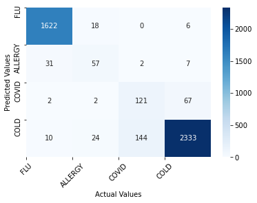
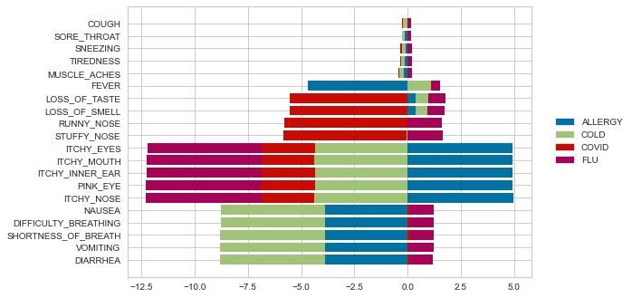

# Covid data analysis  
To classify if the symptoms are for COVID,ALLERGY,COLD or FLU.  

## What is Classification?  
In machine learning, classification refers to a predictive modeling problem where a class label is predicted for a given example of input data.Use the optimal clasification algorithm to predict the result.There are perhaps four main types of classification tasks that you may encounter; they are:  
-Binary Classification  
-Multi-Class Classification  
-Multi-Label Classification  
-Imbalanced Classification  

### What is Binary Classification?  
`Binary classification` is the simplest kind of machine learning problem. 
The goal of binary classification is to categorise data points into one of two buckets: 0 or 1, true or false, to survive or not to survive, blue or no blue eyes, etc.
Popular algorithms that can be used for binary classification include:  
-Logistic Regression  
-k-Nearest Neighbors  
-Decision Trees  
-Support Vector Machine  
-Naive Bayes  
### What is Multi-class Classification?    
In machine learning, `multiclass or multinomial classification` is the problem of classifying instances into one of three or more classes.  
Popular algorithms that can be used for multi-class classification include:  
-k-Nearest Neighbors.  
-Decision Trees.  
-Naive Bayes.  
-Random Forest.  
-Gradient Boosting.  

## Algorithms that can be used for Multi-class classification problems:
**1. K-Nearest Neighbors:**    
The k-nearest neighbors (KNN) algorithm is a simple, easy-to-implement supervised machine learning algorithm that can be used to solve both classification and regression problems. 
It’s easy to implement and understand, but has a major drawback of becoming significantly slows as the size of that data in use grows.  
**USE:** The KNN algorithm can compete with the most accurate models because it makes highly accurate predictions.
Therefore, you can use the KNN algorithm for applications that require high accuracy but that do not require a human-readable model.

**2. Decision Trees:**  
Decision Tree is a Supervised learning technique that can be used for both classification and Regression problems, but mostly it is preferred for solving Classification problems. 
It is a tree-structured classifier, where internal nodes represent the features of a dataset, branches represent the decision rules and each leaf node represents the outcome.  
**USE:**

**3. Naive Bayes:**  
It is a classification technique based on Bayes' Theorem with an assumption of independence among predictors. 
In simple terms, a Naive Bayes classifier assumes that the presence of a particular feature in a class is unrelated to the presence of any other feature.  
**USE:** When assumption of independence holds, a Naive Bayes classifier performs better compare to other models like logistic regression and you need less training data.
It perform well in case of categorical input variables compared to numerical variable(s).

**4. Random forest:**  
Random Forest is a popular machine learning algorithm that belongs to the supervised learning technique. It can be used for both Classification and Regression problems in ML. 
It is based on the concept of ensemble learning, which is a process of combining multiple classifiers to solve a complex problem and to improve the performance of the model.  
**USE:** It provides higher accuracy through cross validation. Random forest classifier will handle the missing values and maintain the accuracy of a large proportion of data.

**5. Gradient Boosting:**  
Gradient boosting is a greedy algorithm and can overfit a training dataset quickly.It can benefit from regularization methods that penalize various parts of the algorithm and generally improve the performance of the algorithm by reducing overfitting.  
**USE:**

## What is Confusion Matrix?  
A `Confusion matrix` is an N x N matrix used for evaluating the performance of a classification model, where N is the number of target classes. The matrix compares the actual target values with those predicted by the machine learning model. This gives us a holistic view of how well our classification model is performing and what kinds of errors it is making.  
* True Positive (TP)  
The predicted value matches the actual value  
The actual value was positive and the model predicted a positive value  
* True Negative (TN)  
The predicted value matches the actual value  
The actual value was negative and the model predicted a negative value  
* False Positive (FP) – Type 1 error  
The predicted value was falsely predicted  
The actual value was negative but the model predicted a positive value  
Also known as the Type 1 error  
* False Negative (FN) – Type 2 error  
The predicted value was falsely predicted  
The actual value was positive but the model predicted a negative value  
Also known as the Type 2 error  

### What is Feature Importance?
Feature importance refers to a class of techniques for assigning scores to input features to a predictive model that indicates the relative importance of each feature when making a prediction. Feature importance scores can be calculated for regression and classification problems.  

## Logictic Reg Feature Importance

